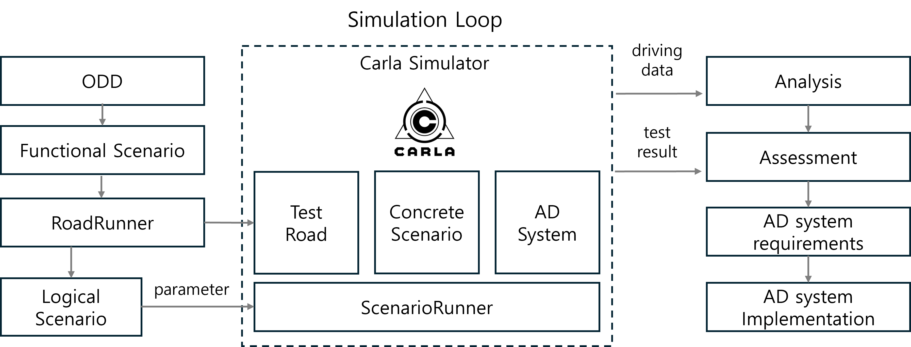
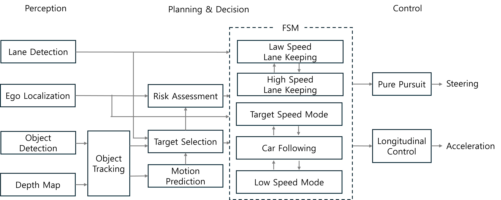
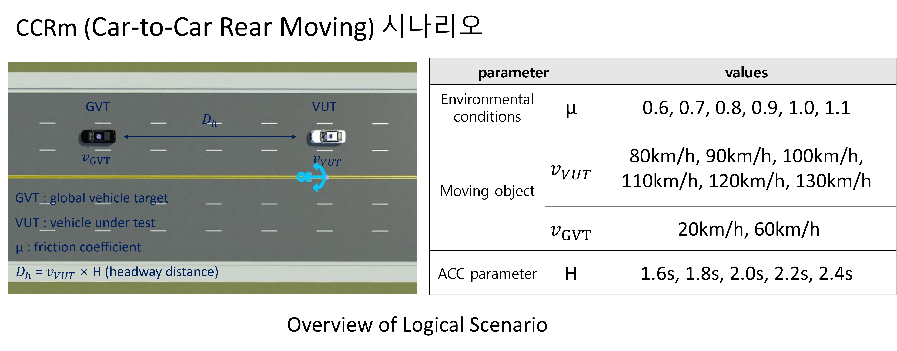
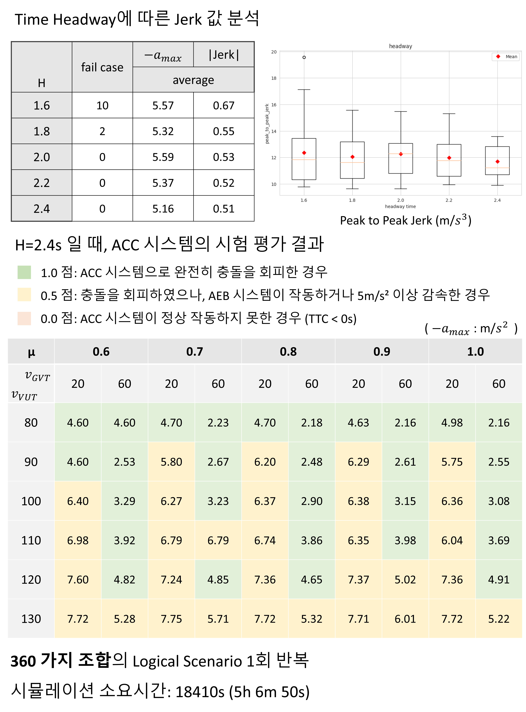

# Introduction 
### Simulaion Loop 
 
* 운영 설계 영역과 시험평가 표준을 고려한 Functional Scenario 도출 
* OpenDrive 형식의 도로와 OpenScenario 형식의 Logical Scenario 제작 
* 자율주행 시스템을 ScenarioRunner를 활용해 CARLA 환경에서 시뮬레이션 
* 파라미터 조합으로 생성된 Concrete Scenario를 자동 수행하며 주행 데이터를 수집 
* 수집된 주행 데이터와 시험 결과를 활용해 추가적인 요구사항을 도출하고 개선된 자율주행 시스템 개발 
### ACC System 

### Experiment Result 
* Euro NCAP CCRm 시나리오에 대한 시험 평가



# Prerequisite 
* OS: Ubuntu (18.04+)
* [pyenv](https://github.com/pyenv/pyenv) 

# Installation 
1. Clone Source Code
```
$ git clone https://github.com/kjs2109/AD-Carla-Simulator.git
```
3. Create Python Environment 
```
$ pyenv install 3.7 
$ pyenv local 3.7
$ pyenv rehash 

$ python -m venv carla-0913-env 
$ source carla-0913-env/bin/activate
```
3. Install Dependencies
```
pip install -r requirements.txt
```
4. Downlaod Custom Asset 
```
# 1. Carla package with the test road
$ cd ./carla_simulator 
$ tar -xf carla_simulator.tar.xz --strip-components=1

# 2. Object Detection Resources
$ cd ./resources 
$ tar -xf resources.tar.xz --strip-components=1
```
# Quick Start 
```
$ source set_carla_env.sh 

# simulation loop 
$ python simulation_loop.py 

# single scenario test 
$ ./carla_simulator/CarlaUE4.sh
$ python scenario_runner.py --openscenario ./scenario/ACC_change_velo.xosc --reloadWorld 

# manual control simulation 
$ ./carla_simulator/CarlaUE4.sh
$ python manual_control.py 
$ python scenario_runner.py --openscenario ./scenario/ACC_change_velo_manual_control.xosc --reloadWorld 
```

# Usage 
* The driving data from the simulation is saved in the ```./saved folder.```
